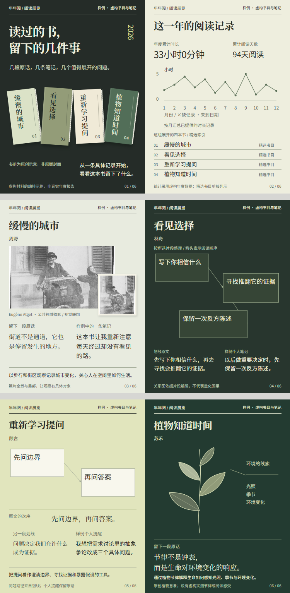

<div align="center">

# 📚年年阅

### 把读过的书，做成一份可以翻、可以分享的年鉴。

今年读了什么？哪些句子还记得？翻一翻就知道。

</div>

年年阅是一个阅读年鉴Skill。接入微信读书后，助手把你的阅读记录整理成一份离线HTML：看看时间花在哪里，翻翻今年的书，再把想分享的几页存成图片。

有划线就留下句子，有笔记就保留自己的想法。没有这些，也可以用书封和阅读记录做一份年鉴。你提供书单或笔记，同样能用。

## 先装上，再聊聊今年的书

安装年年阅：

```bash
npx skills add Surge-Dan/reading-book-skill --skill reading-yearbook-skill -g
```

需要接入微信读书，可先安装腾讯官方Skill：

```bash
npx skills add Tencent/WeChatReading -g
```

按[腾讯官方说明](https://github.com/Tencent/WeChatReading)取得授权，并在助手的本地环境中配置`WEREAD_API_KEY`。密钥不要写进README、截图或公开分享文件。已经接入的账号可以继续用，不需要重新授权。

安装后，在新任务里说：

```text
使用$reading-yearbook-skill，根据我的2026年微信读书记录，
生成一份完整的HTML阅读年鉴，分享图用3:4。
包含阅读统计、书架、阅读分布、时间线，以及已有划线和笔记。
```

采集、封面整理和网页生成由助手处理，你不用填写JSON或自己跑生成命令。接口失效、记录没取全，会说明具体情况。

不连接账号也可以：

```text
用我提供的书单和笔记做一份阅读年鉴。
没有提供的数据不要补，分享图用1:1。
```

## 年鉴里有什么

| 模块 | 可以看什么 |
|---|---|
| 阅读概览 | 已取得的读书数量、阅读天数与时长等统计 |
| 今年读过的书 | 书封、作者、阅读状态和进度；支持搜索与筛选 |
| 阅读分布 | 已载入书目的分类，以及有数据的逐书阅读投入 |
| 阅读时间线 | 从真实日期里整理阅读事件，不猜开始或读完的时间 |
| 划线与笔记 | 原文摘录和个人想法分开展示，可查看书籍详情 |
| 分享与导出 | 选择页面和比例，预览后保存图片或整组打包 |

书目数量和统计跟着你的数据走，不固定成示例中的几本。年度汇总与已载入书目分别标明，缺失的数据不当作零。

[查看离线HTML示例](reading-yearbook-skill/examples/reading-html-demo/index.html)。示例使用虚构书目和笔记，文字封面不代表真实出版物；真实任务会整理对应书封。

## 挑几页，发出去

分享区默认选中封面、阅读统计、阅读分布、阅读时间线，以及全部已载入书籍。你可以取消不想导出的页面，也可以打开书籍多选框，搜索、勾选和预览。

每本书按已有材料组织内容：划线保留原文，个人笔记单独标注；材料较少时，使用书封与真实阅读信息。网页和分享图沿用同一视觉方向。

图片支持1:1、3:4和4:5。制作前确认比例，已经说过的选择不会重复问。

| 导出格式 | 用途 |
|---|---|
| 单张PNG | 保存当前预览的分享卡 |
| 整组ZIP | 打包当前勾选的页面，每页一张PNG |
| PDF | 通过浏览器打印保存阅读档案 |
| Markdown | 保存已载入的阅读资料，方便继续整理 |
| JSON | 保存结构化数据，不重复内嵌封面图片 |

HTML年鉴的PNG和ZIP在浏览器内生成，不需要安装截图工具。导出文件不会自动发布到小红书或其他平台。

## 🎨先看样张，再完成整套

首次制作会结合内容与偏好对齐视觉方向。排版先考虑读什么、怎么看，再安排字体与插画；确认样张后，沿用这套方向完成其余页面。

已有作品只需接着改：

```text
保留这版网页和分享图的风格。
只把书卡的划线和笔记字号统一小一点，其他地方不动。
```

局部修订以最近认可的实际HTML或图片为基准，复用已有材料。数据和逻辑修复不顺带更换主题，也不默认增加界面模块。

只要组图、主题书单或单书卡，也可以直接说明范围，不必做完整年鉴。独立组图流程支持自定义尺寸，并交付编号PNG、整组预览和可编辑的`deck.html`；该流程需要已有Node、Playwright及Chromium或Edge，缺少时保留HTML并说明。

<details>
<summary>看看独立组图的设计样例</summary>

下面是虚构材料的设计样例，不代表每次生成都会采用相同版式。



[阅读展览源文件](reading-yearbook-skill/examples/exhibition-demo/deck.html) · [植物单书卡](reading-yearbook-skill/examples/botanical-demo/deck.html) · [素材与重建说明](reading-yearbook-skill/examples/README.md)

</details>

## 有些情况，先说明白

- **没划线、没笔记**：仍然生成年鉴，用已有书封和阅读信息表达，不补写你的感受。
- **接口没取到记录**：标明未取得或覆盖不足，与已核查的零记录区分。
- **全年书目不完整**：微信读书年度排行最多10项，不能直接当全年书单；根据其他记录核验书目，无法确认的部分会说明。
- **没有完整正文**：年鉴不自动检索全文，也不生成全书书评；书籍简介、摘录和个人笔记各自标明来源。
- **换设备打开**：HTML可离线浏览，字体优先使用本机Noto字族，缺少时回退系统中文字体，字形和断行可能有差异。
- **涉及隐私**：不自动上传阅读记录或发布作品。导出内容仍可能包含个人笔记，分享前请自行检查。

已有数据优先复用，视觉修订不重新采集阅读记录。普通任务只加载当前流程需要的材料；额外生图或扩大素材调研，先说明工作范围。

## 继续了解

| 入口 | 内容 |
|---|---|
| [SKILL.md](reading-yearbook-skill/SKILL.md) | 任务路由与交付规则 |
| [HTML年鉴流程](reading-yearbook-skill/references/html-yearbook.md) | 数据采集、网页与导出说明 |
| [微信读书接入](reading-yearbook-skill/references/weread-api.md) | 接口与数据口径 |
| [艺术指导](reading-yearbook-skill/references/art-direction.md) | 内容如何形成画面 |
| [独立组图流程](reading-yearbook-skill/references/share-workflow.md) | 样张确认、修订与交付 |
| [tests/](tests/) | 数据、交互与导出测试 |

图表部分改编自[lieflat-charts](https://github.com/larashero3-dotcom/lieflat-charts)，使用PolyFormNoncommercial1.0.0许可，商业使用须满足对应许可条件。字体使用时遵循各自许可；Noto字体采用OFL许可。

欢迎提Issue或PullRequest。附上脱敏输入和实际问题，排版问题带一张截图更容易定位；请不要上传密钥或私人阅读记录。

如果它帮你留下了一份想再翻翻的阅读年鉴，欢迎留一颗⭐。
