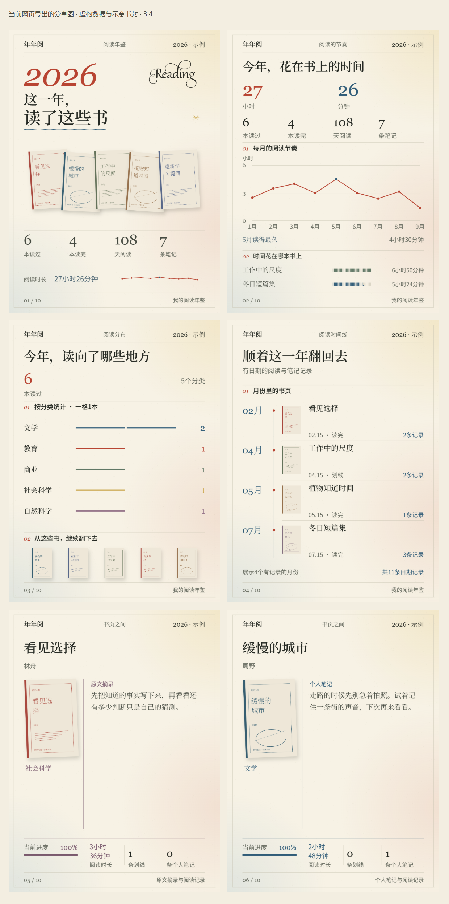

<div align="center">

# 📚年年阅

### 阅读年鉴与分享图Skill

**整理一年的阅读记录，做成可以浏览和分享的年鉴。**

</div>

接入微信读书后，年年阅会把阅读记录整理成一份离线HTML。你可以查看今年的书单和阅读统计，回看划线与笔记，再选几页导出成分享图。

没有划线或笔记也能使用，网页会展示已有书封与阅读信息。你也可以直接提供书单和笔记，不必连接账号。

## 安装与使用

安装年年阅：

```bash
npx skills add Surge-Dan/reading-book-skill --skill reading-yearbook-skill -g
```

需要接入微信读书，可先安装腾讯官方Skill：

```bash
npx skills add Tencent/WeChatReading -g
```

按[腾讯官方说明](https://github.com/Tencent/WeChatReading)取得授权，并在助手的本地环境中配置`WEREAD_API_KEY`。密钥不要写进README、截图或公开分享文件。已经接入的账号可以继续用，不需要重新授权。

安装后，在新任务里说：

```text
使用$reading-yearbook-skill，根据我的2026年微信读书记录，
生成一份完整的HTML阅读年鉴，分享图用3:4。
包含阅读统计、书架、阅读分布、时间线，以及已有划线和笔记。
```

助手会采集记录、整理封面并生成网页，你不用填写JSON或手动运行生成命令。接口失效或记录没取全时，会说明具体情况。

不连接账号也可以：

```text
用我提供的书单和笔记做一份阅读年鉴。
没有提供的数据不要补，分享图用1:1。
```

## 核心功能

| 模块 | 功能 |
|---|---|
| 阅读概览 | 已取得的读书数量、阅读天数与时长等统计 |
| 今年读过的书 | 书封、作者、阅读状态和进度；支持搜索与筛选 |
| 阅读分布 | 书目分类；有对应数据时，展示各本书的阅读时长 |
| 阅读时间线 | 按真实日期整理阅读事件，缺少的起止时间不补写 |
| 划线与笔记 | 原文摘录和个人想法分开展示，可查看书籍详情 |
| 分享与导出 | 选择页面和比例，预览后保存图片或整组打包 |

书目数量和统计根据你的记录生成。年度汇总与已载入书目分别标明，缺失的数据不当作零。

## 效果预览

下面的网页和分享图由当前代码生成，使用虚构阅读记录，书封为原创示意。真实任务会使用用户自己的数据与对应书封。


分享图直接使用网页内的渲染器导出。下图展示四种概览页和两张书卡，分别使用原文摘录与个人笔记。



[下载示例HTML](reading-yearbook-skill/examples/reading-html-demo/index.html)后可离线打开，体验搜索、详情和分享导出；也可以[查看完整PNG组图](reading-yearbook-skill/examples/reading-html-demo/images/)。

## 分享与导出

分享区默认选中封面、阅读统计、阅读分布、阅读时间线，以及全部已载入书籍。你可以取消不想导出的页面，也可以打开书籍多选框，搜索、勾选和预览。

书卡根据已有内容排版，划线保留原文，个人笔记单独标注。没有摘录或笔记的书，使用书封与真实阅读信息。分享图延续网页的风格。

图片支持1:1、3:4和4:5。制作前确认比例，已经说过的选择不会重复问。

| 导出格式 | 用途 |
|---|---|
| 单张PNG | 保存当前预览的分享卡 |
| 整组ZIP | 打包当前勾选的页面，每页一张PNG |
| PDF | 通过浏览器打印保存阅读档案 |
| Markdown | 保存已载入的阅读资料，方便继续整理 |
| JSON | 保存结构化数据，不重复内嵌封面图片 |

HTML年鉴的PNG和ZIP在浏览器内生成，不需要安装截图工具。导出文件不会自动发布到小红书或其他平台。

## 🎨设计与修改

首次制作会先确认你喜欢的风格，再根据内容安排版式。字体和插画要适合阅读，图表要把数据讲清楚。看过并确认样张后，再完成其余页面。

修改已有作品时，可以直接指出要改的地方：

```text
保留这版网页和分享图的风格。
只把书卡的划线和笔记字号统一小一点，其他地方不动。
```

修改以你最近确认的网页或图片为准，复用已有材料。只修数据或逻辑时，不更换主题，也不增加界面模块。

只需要组图、主题书单或单书卡时，也使用同一套分享渲染器。可以从已有年鉴中选页，或根据提供的材料生成；不切换成另一套模板，也不为凑页数补写内容。

网页内置导出支持1:1、3:4和4:5。其他尺寸属于额外开发，需要先确认，不能当作现成功能承诺。

## 数据与使用说明

- **没有划线或笔记**：仍可生成年鉴，展示已有书封与阅读信息，不补写你的感受。
- **接口没取到记录**：标明未取得或覆盖不足，与已核查的零记录区分。
- **全年书目不完整**：微信读书年度排行最多10项，不能直接当全年书单；根据其他记录核验书目，无法确认的部分会说明。
- **没有完整正文**：年鉴不自动检索全文，也不生成全书书评；书籍简介、摘录和个人笔记各自标明来源。
- **换设备打开**：HTML可离线浏览，字体优先使用本机Noto字族，缺少时回退系统中文字体，字形和断行可能有差异。
- **涉及隐私**：不自动上传阅读记录或发布作品。导出内容仍可能包含个人笔记，分享前请自行检查。

修改排版时复用已有记录，不重新采集。普通任务只使用当前需要的材料；额外生图或查找更多素材，会先说明工作范围。

## 项目文档

| 入口 | 内容 |
|---|---|
| [SKILL.md](reading-yearbook-skill/SKILL.md) | 任务路由与交付规则 |
| [HTML年鉴流程](reading-yearbook-skill/references/html-yearbook.md) | 数据采集、网页与导出说明 |
| [微信读书接入](reading-yearbook-skill/references/weread-api.md) | 接口与数据口径 |
| [艺术指导](reading-yearbook-skill/references/art-direction.md) | 内容如何形成画面 |
| [当前示例与重建说明](reading-yearbook-skill/examples/README.md) | 网页预览、分享图片与历史样例说明 |
| [tests/](tests/) | 数据、交互与导出测试 |

图表部分改编自[lieflat-charts](https://github.com/larashero3-dotcom/lieflat-charts)，使用PolyFormNoncommercial1.0.0许可，商业使用须满足对应许可条件。字体使用时遵循各自许可；Noto字体采用OFL许可。

欢迎提Issue或PullRequest。附上脱敏输入和实际问题，排版问题带一张截图更容易定位；请不要上传密钥或私人阅读记录。

如果年年阅帮你整理出了一份想保存或分享的阅读年鉴，欢迎点个⭐。
