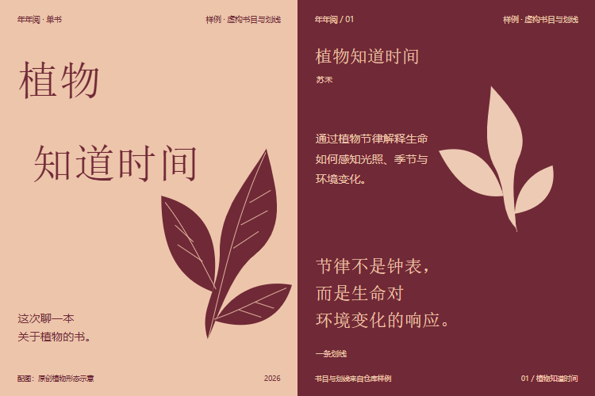

<div align="center">

# 📚年年阅

### 可以翻、可以分享的阅读年鉴Skill

**今年的书，挑几本聊聊。**

</div>

年年阅把微信读书记录或你提供的书单、笔记，整理成一份HTML阅读年鉴。看这一年读了什么、时间花在哪里，也能挑几页导出成分享图。最近刚读完一本，也可以只做两张卡。

网页有阅读统计、书籍分布、时间线、书架和笔记；字体、配色与构图先对齐，再动工。有划线就展示句子，有笔记就留下想法。没划线、没写笔记，也可以有一份完整的阅读年鉴。

安装后接入有效微信读书接口，后面的采集、封面整理和网页制作交给助手。不用填JSON，也不用自己跑命令。接口失效或材料没取全，会明确说明；没有笔记不会挡住生成。

## 先从一句话开始

安装后，在新任务中直接说：

```text
使用$reading-yearbook-skill，把我的2026年阅读记录做成适合小红书分享的图文。
我已接入微信读书接口，请自动采集并交付完整HTML阅读年鉴。
包含阅读统计、分布、真实时间线、完整书架和已有笔记。
分享图用3:4，支持单张、整组、PDF、Markdown和JSON导出。
```

只想分享一本书，可以更简单：

```text
把这本书和我发来的两条笔记做成单书卡。
文字保留我的语气，排版有一点杂志感。
没有写到的感受不用补。
```

已有作品时，接着改就好：

```text
只改第3页，把介绍再写短一点。
封面和其他页保持不变，复用已有图片。
```

## 可以做什么

| 场景 | 适合怎么用 | 拿到什么 |
|---|---|---|
| HTML阅读年鉴 | 浏览全年记录，展开划线与笔记 | 单文件离线网页，含分享与数据导出 |
| 年度阅读分享 | 从一年里挑几本，聊自己的阅读所得 | 封面、独立年度概览和精选书卡 |
| 主题书单 | 围绕一个话题整理几本书 | 有顺序、有重点的书单图文 |
| 单书卡 | 分享一本书、一段划线或自己的笔记 | 少量图片，页数跟着内容走 |
| 作品修订 | 改字、调整一页构图或换一张素材 | 更新受影响的页面，复用其余图片 |

年度精选建议3–5本，加上封面和概览通常5–7张。单书可以更少，材料不多就少做几页。书目、张数和图片比例都先和你确认。

只想做组图，直接说就好。原有阅读图谱和深度蒸馏仍可单独使用；HTML操作见[年鉴流程](reading-yearbook-skill/references/html-yearbook.md)。

## 🎨画面从书里找

街道观察可以用同一张照片的全景和局部；决策笔记可以把假设与反方证据摆在一起。先看这页要讲什么，再决定怎么画。

配色和版式从材料与偏好里决定。照片裁切和文字叠放，都要让内容更容易读。整套作品要有联系，也要有轻重变化。

每页先明确主意象、阅读顺序、实际素材和字体职责，再做样张。同一本书的不同笔记也能有不同的画面；拼贴只是可选方向。导出会核对实际字体、图层和可检测的文字遮挡，最终质感仍要看图片确认。

短文也一样。介绍讲清书里写什么，笔记保留原话，补充感受由你提供。引用逐字保留，编辑归纳会与引用区分。

具体方法见[艺术指导](reading-yearbook-skill/references/art-direction.md)。

## 先看看作品

### 阅读年鉴

[查看离线HTML示例](reading-yearbook-skill/examples/reading-html-demo/index.html)。示例数据不代表真实阅读记录。统计、分类和笔记可以展开浏览；分享图片直接在浏览器生成。

### 阅读展览

六页分别展开书册陈列、年度轨迹、城市观察、决策关系、提问路径和植物意象。不同的材料有不同的读法。


[查看可编辑源文件](reading-yearbook-skill/examples/exhibition-demo/deck.html)

### 一本关于植物的书

这组换成杏色、暗红与植物剪影，只用简介和划线，没有补写个人感受。



[查看可编辑源文件](reading-yearbook-skill/examples/botanical-demo/deck.html)

两组均为虚构书目与笔记的设计样例，页内已注明。照片来源、使用依据和重建方式见[样例说明](reading-yearbook-skill/examples/README.md)。新任务会重新判断视觉方向。

## 从材料到图片，怎么走

HTML先复用数据、核对覆盖，再对齐视觉原型，最后实际测试浏览与导出。已经确认的年份、比例和方向不会重复问。下面是只做组图时的流程：

1. **确认范围**：复用已有记录，集中确认场景、年份、比例、候选书目和张数。
2. **确认内容与方向**：看全部分镜、逐页短文和两个有参考依据的设计方向，选定后再排版。
3. **确认样张**：看封面、年度概览和不同结构的代表书卡，检查实际字体、图表和手机阅读效果。
4. **完成整套**：沿用确认的方向补齐其余页，检查后交付。

默认三个确认点，相关问题集中处理。你不用编辑JSON或运行截图命令；已经说清的选择不会反复问，旧作品的认可也不会被当成新作品的同意。

改一页就沿用现有任务。已有材料不重复采集，两个方向只做少量参考比较，选定后只做一套样张；普通分享不默认调用一串其他Skill。生图、额外方向或更大范围的素材探索，先说明额外工作。

## 最后会拿到什么

年鉴默认交付单文件HTML，离线打开即可浏览。分享页支持单张PNG和整组ZIP，也能打印为PDF、导出Markdown与JSON；密钥和鉴权响应不放进交付。字体优先使用本机Noto中文字族，其他设备回退系统字体。

单独组图任务仍交付：

- 按发布顺序编号的PNG及整组预览，比例由你选择，支持1:1、3:4、4:5和自定义尺寸。
- 一份可编辑的`deck.html`与实际素材，需要时附短发布文案。
- 内容与素材来源记录，以及当前版本的验证报告。

文字、素材和图片版本会一起校验。改动后，旧确认可能失效；导出失败会保留此前有效图片，同时说明当前版本尚未完成。

操作细节见[分享流程](reading-yearbook-skill/references/share-workflow.md)。

## 安装与准备

在Codex环境中，通过Skill安装器执行：

```powershell
python "$env:USERPROFILE\.codex\skills\.system\skill-installer\scripts\install-skill-from-github.py" `
  --repo Surge-Dan/reading-book-skill `
  --path reading-yearbook-skill
```

安装后，在新任务中使用`$reading-yearbook-skill`，也可以直接描述需求，让助手按任务匹配Skill。

读取微信读书记录需要在本地配置`WEREAD_API_KEY`，接口细节见[微信读书接入](reading-yearbook-skill/references/weread-api.md)。已有书单或笔记可以直接提供，不必连接账号。密钥只从环境变量读取，不发进对话或写进分享文件。

HTML年鉴的PNG与整组ZIP在浏览器内生成，无需安装截图工具。原有独立组图流程的PNG导出需要已有Node、Playwright和Chromium或Edge；缺少时保留HTML并说明，不自动安装。

## 内容有边界

- 读到哪儿就讲到哪儿，不从零散笔记推断整本书。网页保留真实记录，不自动生成全书书评。
- 年鉴说明时间范围与采集日期；缺失月份、未知进度和未载入书目分别标明，不当作零。
- 分享包不包含原始响应或密钥，作品由你决定是否发布。

本地样例用于验证导出与修订流程，不代表新作品的视觉效果已获认可。材料驱动工作流及实际浏览器验证见[实现记录](docs/superpowers/specs/2026-10-03-material-led-implementation.md)。发布仍由你决定。

## 项目结构

| 文件 | 用途 |
|---|---|
| [SKILL.md](reading-yearbook-skill/SKILL.md) | Skill入口与任务路由 |
| [references/](reading-yearbook-skill/references/) | 艺术指导、分享流程与数据规则 |
| [scripts/](reading-yearbook-skill/scripts/) | 内容准备、图片导出与版本校验 |
| [examples/](reading-yearbook-skill/examples/) | 完整作品、源文件与重建脚本 |
| [tests/](tests/) | 数据规则与分享流程测试 |
| [docs/](docs/) | 研究依据、改进说明与验证记录 |

## 反馈与共创

欢迎提Issue或PullRequest。附上脱敏后的输入、期望效果与实际差异；排版问题再带一张截图，会更容易定位。请不要上传密钥或未经脱敏的阅读记录。

如果它帮你整理出了一篇想发出去的阅读分享，欢迎留一颗⭐。
